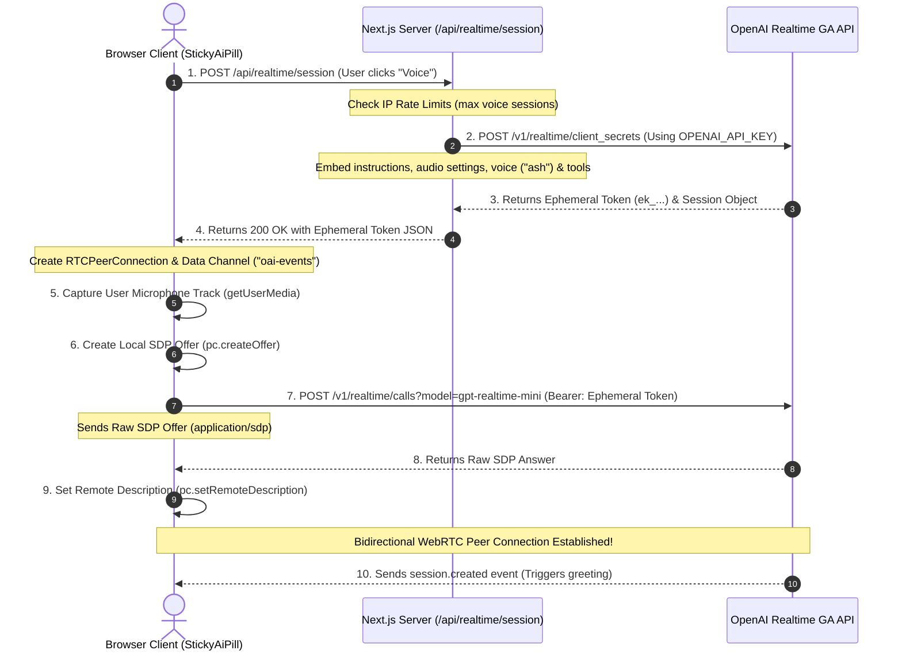

# Next.js WebRTC OpenAI Realtime Voice Agent Documentation

This document provides a comprehensive technical overview of the voice agent implementation, mapping out its architecture, connection workflows, file structures, and function tools. Use this as a reference guide to easily understand, rebuild, or modify the voice agent in the future.

---

## 1. System Architecture

The voice agent is built using a **hybrid client-server architecture**:
*   **Backend Server (Next.js API Route):** Securely authenticates with OpenAI using the primary `OPENAI_API_KEY`, runs rate limiting, attaches instructions and custom tools, and generates a temporary **ephemeral token** (client secret).
*   **Frontend Client (React/Next.js Page Component):** Obtains the ephemeral token from the backend, captures local microphone tracks, conducts the **WebRTC SDP exchange**, and manages the bi-directional audio streaming and data channel directly with OpenAI.

### Connection Sequence Diagram



---

## 2. File Roles & Descriptions

The agent's logic is distributed across these key source files:

### 1. Backend: [src/app/api/realtime/session/route.ts](file:///Users/shahidshamir/Desktop/ARC-AI-Files/ARC%20AI%20+%20personal/ARC%20website%20backups/latest%20arc%20website16.12,25/src/app/api/realtime/session/route.ts)
*   **Role:** Acts as the secure credential gatekeeper.
*   **Primary Logic:**
    *   Reads and checks the environment variable `OPENAI_API_KEY`.
    *   Identifies client IP via `getClientIP(req)`.
    *   Validates session rate limits through `checkVoiceSessionLimit(clientIP)`.
    *   Fetches the ephemeral key from `https://api.openai.com/v1/realtime/client_secrets` utilizing the **GA schema** (nested `audio` config instead of deprecated top-level fields).
    *   Defines and injects the array of custom **function tools** (RAG searches, proposal creation, navigation hooks) that the model is allowed to invoke.

### 2. Frontend Component: [src/components/StickyAiPill.tsx](file:///Users/shahidshamir/Desktop/ARC-AI-Files/ARC%20AI%20+%20personal/ARC%20website%20backups/latest%20arc%20website16.12,25/src/components/StickyAiPill.tsx)
*   **Role:** The conversational visual wrapper and WebRTC transport manager.
*   **Primary Logic:**
    *   Renders the floating floating "Pill" UI representing the chat and voice actions.
    *   Retrieves the ephemeral client secret via a POST request to `/api/realtime/session`.
    *   Establishes the `RTCPeerConnection` and hooks up `<audio>` element streams with manual autoplay overrides to satisfy iOS Safari restrictions.
    *   Connects microphone tracks using `getUserMedia` with echo cancellation and noise suppression enabled.
    *   Manages the `"oai-events"` WebRTC Data Channel to listen for model responses, greeting states (`session.created`), speech started/stopped flags, and function execution calls.
    *   Executes frontend side-effects (e.g. routing the user, popping up Calendly) when requested by a model function call, returning output back to OpenAI.

### 3. Rate Limit Helper: `src/lib/rate-limit.ts`
*   **Role:** Tracks IP session request thresholds dynamically to safeguard against brute-force token exhaustion.

### 4. Prompt Context: `src/lib/ai-context.ts`
*   **Role:** Exports `VOICE_SYSTEM_PROMPT`, defining the character behavior, services knowledge parameters, and tone constraint rules for the voice agent.

---

## 3. The OpenAI Realtime GA Request Schema

To keep the system fully compliant with the GA version of the Realtime API (launched May 2026), ensure the payload structure follows these schema guidelines:

### GA-Compliant Session Object (Server-side)
In General Availability, top-level session parameters like `modalities`, `voice`, and `turn_detection` are **deprecated**. They are migrated to a nested structure under a top-level `audio` configuration.

```json
{
  "session": {
    "type": "realtime",
    "model": "gpt-realtime-mini",
    "instructions": "System instructions prompt...",
    "audio": {
      "input": {
        "turn_detection": {
          "type": "server_vad",
          "threshold": 0.9,
          "prefix_padding_ms": 300,
          "silence_duration_ms": 800
        }
      },
      "output": {
        "voice": "ash"
      }
    },
    "tools": [
      {
        "type": "function",
        "name": "toolName",
        "description": "Tool explanation",
        "parameters": { ... }
      }
    ],
    "tool_choice": "auto"
  }
}
```

### WebRTC Connection URL (Client-side)
In GA, the client must POST the local SDP offer to the official `/calls` endpoint, passing the target model in the query parameter string:
*   **SDP POST URL:** `https://api.openai.com/v1/realtime/calls?model=gpt-realtime-mini`
*   **Authorization Header:** `Bearer ek_...` (ephemeral key)
*   **Content-Type:** `application/sdp`

---

## 4. Built-in Function Tools

The agent is pre-configured with 5 client-side function tools. When the model invokes these functions, it sends a payload over the `"oai-events"` data channel, triggering React actions:

1.  **`searchCompanyKnowledge` (RAG Knowledge base search):** Queries company background context and service details if the model needs pricing or capability info.
2.  **`sendProposal` (Pricing custom proposals):** Triggers custom packaging workflows for prospects.
3.  **`saveLead` (CRM registration):** Saves user data and transcripts as a lead directly in the database.
4.  **`subscribeNewsletter` (Email collection):** Registers interested users for updates.
5.  **`navigateClientScreen` (Co-browsing navigation):** Remotely shifts the user's browser route (`router.push`) to case studies (`/portfolio`), website pricing (`/web-pricing`), AI pricing (`/ai-pricing`), or opens the Calendly booking popup (`#calendly`). Note: The client component includes robust fallbacks that map generic `/pricing` requests directly to `/ai-pricing` to prevent broken routes.

---

## 5. Quick-Reference Rebuilding Steps

If you need to reconstruct the voice agent from scratch, follow these modular steps:

### Step 1: Set up the Server Endpoint
Create a POST route that:
1.  Enforces rate limits by IP.
2.  Fetches `https://api.openai.com/v1/realtime/client_secrets` sending the GA-structured body (using `gpt-realtime-mini` or `gpt-realtime-2`).
3.  Returns the JSON response including `client_secret.value`.

### Step 2: Establish the Client WebRTC Handshake
1.  Fetch the ephemeral token from your endpoint.
2.  Instantiate `const pc = new RTCPeerConnection()`.
3.  Bind incoming tracks from `pc.ontrack` directly to a local HTML `Audio` element.
4.  Capture and add mic stream: `const ms = await getUserMedia(...)` followed by `pc.addTrack(ms.getTracks()[0])`.
5.  Add a data channel: `pc.createDataChannel("oai-events", { ordered: true })`.
6.  Generate and set local description: `const offer = await pc.createOffer()` and `await pc.setLocalDescription(offer)`.
7.  Post `offer.sdp` to `https://api.openai.com/v1/realtime/calls?model=gpt-realtime-mini` using the ephemeral token in headers.
8.  Feed the returned answer back to WebRTC: `await pc.setRemoteDescription({ type: "answer", sdp: answerSdp })`.

### Step 3: Handle Greetings and Tools
1.  Listen to `"message"` events on the data channel.
2.  Upon receiving `event.type === 'session.created'`, deliver the initial greeting by sending a `response.create` payload containing explicit instructions.
3.  Handle `event.type === 'response.function_call_arguments.done'` by executing the associated function and returning the output payload via a `conversation.item.create` (type `function_call_output`) event followed by another `response.create` trigger to resume generation.
